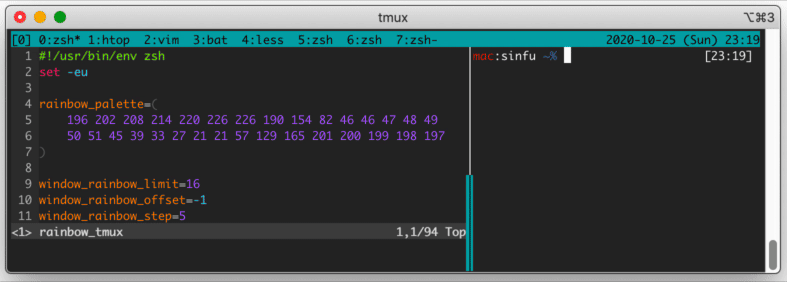

# Rainbow tmux

This repository contains a joke script `rainbow_tmux` that animates tmux style
in rainbow colors. Requires 256-color terminal and zsh (as a script interpreter,
not a login shell).



## Usage

Run `rainbow_tmux` script.

```sh
git clone https://github.com/snsinfu/rainbow-tmux.git
cd rainbow-tmux
./rainbow_tmux
```

## License

MIT
